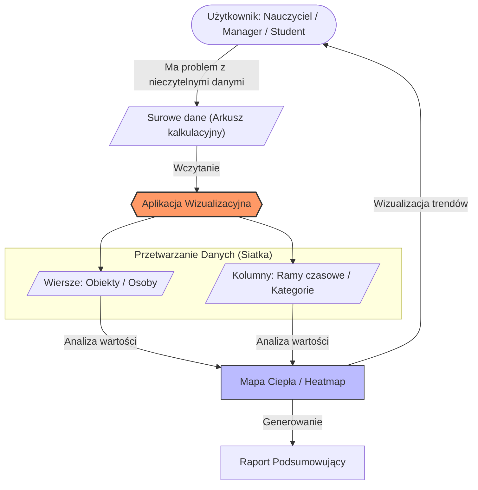

```mermaid
graph TD
    User([Użytkownik: Nauczyciel / Manager / Student])
    Input[/"Surowe dane (Arkusz kalkulacyjny)"/]
    App{{Aplikacja Wizualizacyjna}}
    
    subgraph "Przetwarzanie Danych (Siatka)"
        Rows[/"Wiersze: Obiekty / Osoby"/]
        Cols[/"Kolumny: Ramy czasowe / Kategorie"/]
    end
    
    Heatmap[Mapa Ciepła / Heatmap]
    Report[Raport Podsumowujący]
    
    User -->|Ma problem z nieczytelnymi danymi| Input
    Input -->|Wczytanie| App
    App --> Rows & Cols
    Rows & Cols -->|Analiza wartości| Heatmap
    Heatmap -->|Wizualizacja trendów| User
    Heatmap -->|Generowanie| Report
    
    style App fill:#f96,stroke:#333,stroke-width:2px
    style Heatmap fill:#bbf,stroke:#333
```